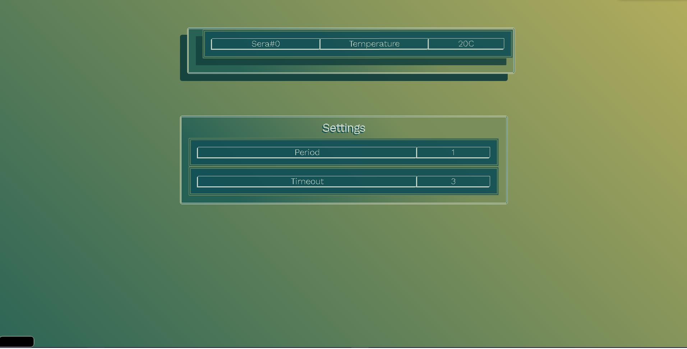

# Multidisciplinary Design Project
 
 

 A GreenHouse System with team consisting multiple fields

Uses **Hamachi** for creating a Virtual Private Network so only devices that registered to hamachi network can access to server. Also Zero One Tier can be used to allow  system control from mobile devices.

! Server is NOT running on web so management system is fully closed to the internet

System consist of 4 components: **Monitor Software**, **Server Software**, **Client Software**, **Circuit Simulation with Arduino software**

* **Monitor Software**: Developed using **HTML**, **CSS**, **Javascript**. Ajax Requests and DOM Manipulation used to show/request data dynamically. Can transmit temperature change requests to Client Software through Server Software. 
* **Server Software**: Developed using **Java** ,Spring Boot Framework. Stores values, communication parameters and timing data; transmits temperature requests from monitor software to client software. Sends greenhouse temperature and availability data to monitor software.
* **Client Software**: Developed using **Python**. Gets temperature request data, synchronization and communication settings from server software, reads temperature from circuit simulation through COM port which is virtualized and sends to server in a configurable period. Writes request data to COM port. If circuit or software fails, server will know it and report it to monitor.
* **Circuit/Arduino**: This part done by other group members so i dont know how it works.

Softwares communicate with each other using HTTP method, sends data in JSON format.

Tanıtım Videosu : 
